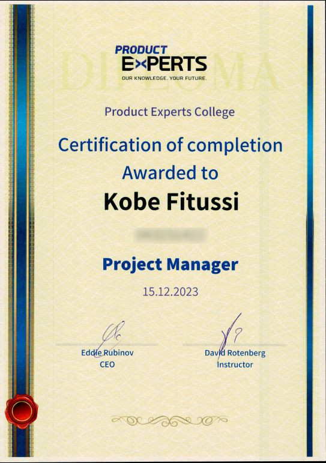

 Curriculum:
 <ul>
    <li> Project Planning and WBS.</li>
    <li> Contractual work, SOW, Contracts.</li>
    <li> Risk management, FMEA - RPN.</li>
    <li> 5w2h, SWOT, Stakeholder Mapping, Product phases, ROI.</li>
    <li> Storytelling and Presentation.</li>
    <li> Waterfall, MRD/PRD, SysRs, Design Review, Preliminary Design Review, Critical Design Review, Quality Assurance.</li>
    <li> Cloud-based Business models - IaaS, Paas, SaaS.</li>
    <li> IoT, Cyber Security, ISO 21001, SOC2, UL 2900.</li>
    <li> SCRUM, Planning phases, Backlog Grooming, Sprint, Review, Retro, Kanban(Hardware).</li>
    <li>Authoring Epic, User story and tasks.</li>
</ul>

Mid-Course group project: PolluSentry
Product management and project initialization of wearable air quality sensors supported by big data analysis for multiple tiers 
 <ul>
	<li> Problem statement</li>
	<li> Target Audience</li>
	<li> Market Analysis</li>
	<li> Business model</li>
	<li> Timeline and Phases</li>
	<li> SWOT</li>
	<li> Marketing Strategy</li>
 </ul>

